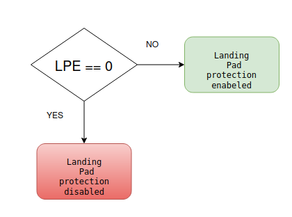
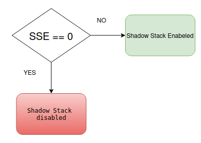
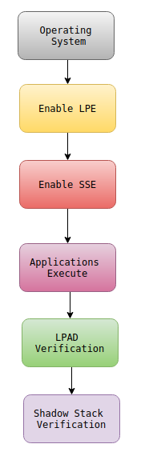

# Understanding the RISC-V Control-Flow Integrity (CFI) ISA - Part 3: Privileged Architecture

<p align="center">
  
</p>


## Introduction

In the previous two posts, I explored the **<mark class="bg-yellow-200 dark:bg-yellow-500/30">Landing Pad (Zicfilp)</mark>** and **<mark class="bg-yellow-200 dark:bg-yellow-500/30">Shadow Stack (Zicfiss)</mark>** extensions from the **<mark class="bg-yellow-200 dark:bg-yellow-500/30">Unprivileged ISA</mark>**<mark class="bg-yellow-200 dark:bg-yellow-500/30">.</mark>

Those chapters describe how the instructions work and how the processor enforces Control-Flow Integrity during program execution.

However, an important question still remains.

**Who enables these security mechanisms?**

The answer lies in the **<mark class="bg-yellow-200 dark:bg-yellow-500/30">Privileged ISA</mark>**, which defines how operating systems and higher privilege levels configure and manage these hardware security features.

This post summarizes my understanding of **Section 16.1** of the RISC-V Privileged ISA specification.

Reference

*   [https://docs.riscv.org/reference/isa/v20260120/priv/priv-cfi.html](https://docs.riscv.org/reference/isa/v20260120/priv/priv-cfi.html)
    

* * *

# Unprivileged vs Privileged ISA

Before studying the privileged CFI specification, it is important to understand why RISC-V separates the architecture into two volumes.

The **<mark class="bg-yellow-200 dark:bg-yellow-500/30">Unprivileged ISA</mark>** defines the behavior of instructions that applications execute.

Examples include

*   Arithmetic instructions
    
*   Load/Store instructions
    
*   Branch instructions
    
*   LPAD
    
*   Shadow Stack instructions
    

The **<mark class="bg-yellow-200 dark:bg-yellow-500/30">Privileged ISA</mark>**<mark class="bg-yellow-200 dark:bg-yellow-500/30">, </mark> on the other hand, defines how the operating system and firmware configure the processor.

Instead of introducing new application instructions, it explains

*   how CFI is enabled,
    
*   which privilege modes may use it,
    
*   how traps preserve CFI state,
    
*   how Shadow Stack memory is protected, and
    
*   how Control and Status Registers (CSRs) control the extension. ([RISC-V Documentation](https://docs.riscv.org/reference/isa/priv/priv-cfi.html?utm_source=chatgpt.com))
    

* * *

# Where Does the Privileged ISA Fit?

A simplified software stack can be viewed as

*   Applications
    
*   Operating System
    
*   Firmware / SBI
    
*   Processor
    

Applications execute LPAD instructions. The operating system decides whether LPAD protection is enabled.

* * *

# Landing Pad Enable State

*(Section 16.1.1.1)*

One of the first concepts introduced by the privileged specification is the **Landing-Pad-Enabled (LPE)** state. Unlike the unprivileged specification, which assumes LPAD support exists, the privileged specification explains that the extension must first be enabled. Conceptually,

<p align="center">
  
</p>


When disabled, LPAD instructions still execute as ordinary instructions, but no forward-edge control-flow verification takes place. ([RISC-V Documentation](https://docs.riscv.org/reference/isa/priv/priv-cfi.html?utm_source=chatgpt.com))

* * *

# Different Privilege Modes Can Have Different Settings

One interesting feature is that every privilege level can have its own LPE configuration. i.e

```text
Machine Mode  
↓
LPE Enabled
```

```text
Supervisor Mode
↓
LPE Enabled
```

```text
User Mode
↓
LPE Disabled
```

<mark class="bg-yellow-200 dark:bg-yellow-500/30">or any other supported combination.</mark>

This allows an operating system to selectively enable CFI protection depending on the execution environment. ([RISC-V Documentation](https://docs.riscv.org/reference/isa/priv/priv-cfi.html?utm_source=chatgpt.com))

* * *

# Preserving Expected Landing Pad State

*(Section 16.1.1.2)*

Suppose an interrupt occurs immediately after an indirect jump.

```text
Indirect Jump
↓
Processor expects LPAD
↓
Interrupt occurs
```

The operating system now handles the interrupt.Eventually, execution resumes. If the processor forgot that it was waiting for an LPAD instruction, the security mechanism would fail.

Therefore, the privileged specification requires the processor to <mark class="bg-yellow-200 dark:bg-yellow-500/30">preserve the </mark> **<mark class="bg-yellow-200 dark:bg-yellow-500/30">Expected Landing Pad state</mark>** across traps and restore it correctly before execution resumes. ([RISC-V Documentation](https://docs.riscv.org/reference/isa/priv/priv-cfi.html?utm_source=chatgpt.com))

* * *

# Shadow Stack Access Control

*(Section 16.1.2.1)*

The Shadow Stack contains trusted return addresses. Allowing ordinary software to freely modify it would defeat its purpose.

Therefore, the privileged specification defines access control for the Shadow Stack Pointer (SSP) CSR. Only software executing with appropriate privilege may configure or manage these resources. User applications cannot arbitrarily reconfigure the Shadow Stack state. ([RISC-V Documentation](https://docs.riscv.org/reference/isa/priv/priv-cfi.html?utm_source=chatgpt.com))

* * *

# Shadow Stack Enable State

*(Section 16.1.2.2)*

Similar to Landing Pads, Shadow Stack protection also has an enable state.

Conceptually,

<p align="center">
  
</p>


Only when Shadow Stack protection is enabled does the processor perform protected return-address verification. ([RISC-V Documentation](https://docs.riscv.org/reference/isa/priv/priv-cfi.html?utm_source=chatgpt.com))

* * *

# Shadow Stack Memory Protection

*(Section 16.1.2.3)*

The privileged specification also explains that the <mark class="bg-yellow-200 dark:bg-yellow-500/30">Shadow Stack must reside in protected memory.</mark> Simply storing trusted return addresses in ordinary writable memory would allow attackers to overwrite both copies.

Instead, hardware memory protection ensures that only authorized Shadow Stack operations may update Shadow Stack memory. ([RISC-V Documentation](https://docs.riscv.org/reference/isa/priv/priv-cfi.html?utm_source=chatgpt.com))

* * *

# Overall View

The complete CFI flow can now be viewed as

<p align="center">
  
</p>


The privileged specification provides the configuration and protection mechanisms required before the unprivileged CFI instructions can securely operate.

* * *

# Real-Life Analogy

Imagine a university laboratory. Students can use laboratory equipment.

However, they cannot unlock the laboratory, install new security cameras, or change access permissions. Only the laboratory administrator can perform those actions.

<mark class="bg-yellow-200 dark:bg-yellow-500/30">Similarly,</mark> applications execute CFI instructions, while the operating system configures, enables, and protects the CFI infrastructure.

* * *

# Key Takeaways

After studying **Section 16.1** of the Privileged ISA specification, these are my main observations:

*   The Unprivileged ISA defines **<mark class="bg-yellow-200 dark:bg-yellow-500/30">how CFI instructions work</mark>**.
    
*   The Privileged ISA defines **<mark class="bg-yellow-200 dark:bg-yellow-500/30">how those instructions are enabled and managed</mark>**<mark class="bg-yellow-200 dark:bg-yellow-500/30">.</mark>
    
*   Landing Pad protection is controlled through the **<mark class="bg-yellow-200 dark:bg-yellow-500/30">Landing-Pad-Enabled (LPE)</mark>** <mark class="bg-yellow-200 dark:bg-yellow-500/30"> state.</mark>
    
*   Shadow Stack protection is controlled through the **<mark class="bg-yellow-200 dark:bg-yellow-500/30">Shadow-Stack-Enabled (SSE)</mark>** <mark class="bg-yellow-200 dark:bg-yellow-500/30"> state.</mark>
    
*   Expected Landing Pad state is preserved across traps and interrupts.
    
*   <mark class="bg-yellow-200 dark:bg-yellow-500/30">Access to the Shadow Stack Pointer is privilege-controlled.</mark>
    
*   Shadow Stack <mark class="bg-yellow-200 dark:bg-yellow-500/30">memory </mark> receives additional protection through privileged mechanisms.
    

* * *

# Conclusion

The Unprivileged and Privileged specifications complement each other.

The <mark class="bg-yellow-200 dark:bg-yellow-500/30">Unprivileged</mark> ISA provides the security primitives—Landing Pads and Shadow Stack instructions—while the <mark class="bg-yellow-200 dark:bg-yellow-500/30">Privileged </mark> ISA ensures that these mechanisms are securely enabled, preserved across exceptions, and protected from unauthorized modification.

Only after studying both specifications does the complete RISC-V Control-Flow Integrity architecture become clear. ([RISC-V Documentation](https://docs.riscv.org/reference/isa/priv/priv-cfi.html?utm_source=chatgpt.com))