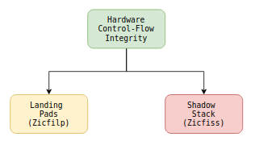
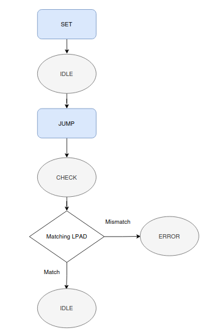

# From a Simple FSM to Hardware Control-Flow Integrity: Understanding the Purpose of the RISC-V CFI Coding Challenge

  

## Introduction

After spending the past few days studying the RISC-V Control-Flow Integrity (CFI) specification, one question kept coming to my mind.

**<mark class="bg-yellow-200 dark:bg-yellow-500/30">Why was the coding challenge designed as such a simple three-state finite state machine?</mark>**

At first glance, the challenge looked almost unrelated to the actual mentorship project, which involves implementing hardware <mark class="bg-yellow-200 dark:bg-yellow-500/30">support for </mark> **<mark class="bg-yellow-200 dark:bg-yellow-500/30">Landing Pads (Zicfilp)</mark>** <mark class="bg-yellow-200 dark:bg-yellow-500/30"> and </mark> **<mark class="bg-yellow-200 dark:bg-yellow-500/30">Shadow Stack (Zicfiss)</mark>** <mark class="bg-yellow-200 dark:bg-yellow-500/30"> inside the </mark> [**<mark class="bg-yellow-200 dark:bg-yellow-500/30">Sargantana</mark>**](https://github.com/bsc-loca/sargantana) Linux-capable RISC-V processor.

However, after studying the specification more carefully, I realized the opposite.

The coding challenge intentionally extracts the fundamental concept behind one part of hardware-assisted Control-Flow Integrity while keeping the implementation small enough to focus on the verification logic rather than processor complexity.

In this blog, I summarize my understanding of how the coding challenge relates to the actual project and why I believe it serves as an excellent introduction before modifying a real processor pipeline.

* * *

# The Actual Mentorship Project

The mentorship project focuses on implementing the recently ratified RISC-V Control-Flow Integrity ISA extensions inside the **Sargantana** processor.

The project can be broadly divided into two major components.

  

The complete implementation involves

*   studying the CFI ISA specification,
    
*   understanding the Sargantana microarchitecture,
    
*   modifying the processor pipeline,
    
*   implementing hardware support for Shadow Stack,
    
*   implementing Landing Pad verification,
    
*   verifying correctness,
    
*   evaluating hardware overhead.
    

Clearly, this is a much larger engineering effort than implementing a small FSM.

So why begin with such a simple coding challenge?

* * *

# Understanding the Core Idea

The key objective of Control-Flow Integrity is surprisingly simple.

Whenever execution reaches an indirect branch target, the processor must determine whether that destination is actually valid.

Conceptually,

  

Everything else in the specification builds upon this simple verification principle.

The coding challenge isolates exactly this idea.

* * *

# The Simplified Model

Instead of implementing an entire superscalar processor, the challenge models the verification logic using only three states.

Although small, this state machine captures the essential behavior of Landing Pad verification.

  

* * *

# What Does Each Command Represent?

The challenge defines three commands.

| Command | Meaning |
| --- | --- |
| **SET** | Store a trusted landing pad label. |
| **JUMP** | Simulate an indirect control-flow transfer that requires verification. |
| **LPAD** | Verify that execution arrived at the expected landing pad. |

Instead of decoding real instructions, the challenge communicates through simple packets.

  

This allows the verification mechanism to be studied independently of instruction decoding.

* * *

# Mapping the FSM to the Actual Hardware

One of the most interesting observations is that each FSM state loosely corresponds to a stage of the actual hardware implementation.

| FSM State | Hardware Interpretation |
| --- | --- |
| **IDLE** | Processor executes normally while waiting for an indirect branch. |
| **CHECK** | Processor has executed an indirect jump and must verify the Landing Pad before continuing. |
| **ERROR** | Verification failed and a security exception would be generated. |

The real processor obviously contains many additional pipeline stages, buffers, and control logic, but the decision-making process remains very similar.

* * *

# What the Real Processor Adds

The coding challenge intentionally ignores many aspects that a real processor must handle.

For example,

the <mark class="bg-yellow-200 dark:bg-yellow-500/30">real implementation must support</mark>

*   instruction fetch,
    
*   instruction decode,
    
*   speculative execution,
    
*   branch prediction,
    
*   pipeline flushing,
    
*   commit-stage verification,
    
*   trap handling,
    
*   privilege levels,
    
*   interaction with Linux,
    
*   hardware exceptions.
    

The simplified FSM abstracts all of these details away.

Its purpose is to focus solely on the security decision.

* * *

# Where Does Shadow Stack Fit?

Interestingly, the coding challenge models only one portion of the complete CFI architecture. (LPAD)

The project itself also requires implementing the **Shadow Stack** (SS) extension.

  

Landing Pads protect **forward-edge control flow**, while the Shadow Stack protects **backward-edge control flow** by securing return addresses.

The FSM only demonstrates the Landing Pad verification concept.

The complete project will combine both mechanisms.

* * *

# Lessons Learned

Working through this challenge reinforced several important ideas.

First, hardware security mechanisms often rely on surprisingly simple state transitions.

Second, simplifying a complex architecture into an abstract model makes it much easier to understand the underlying concept before tackling a full-scale implementation.

Finally, the challenge highlights an important engineering principle:

> Before modifying a large processor, it is essential to understand the core behavior in isolation.

* * *

# Looking Ahead

With the coding challenge completed, the next logical step is to study the **Sargantana** processor itself.

*   The CFI specification explains **what** needs to be implemented.
    
*   The coding challenge demonstrates **why** the verification logic works.
    
*   The remaining task is understanding **where** these mechanisms fit inside a real Linux-capable RISC-V core.
    

That will be the focus of my next blog, where I'll explore the Sargantana microarchitecture and identify the pipeline components that will eventually require modification for hardware-assisted Control-Flow Integrity. Then I will write a full proposal for this project of CFI .