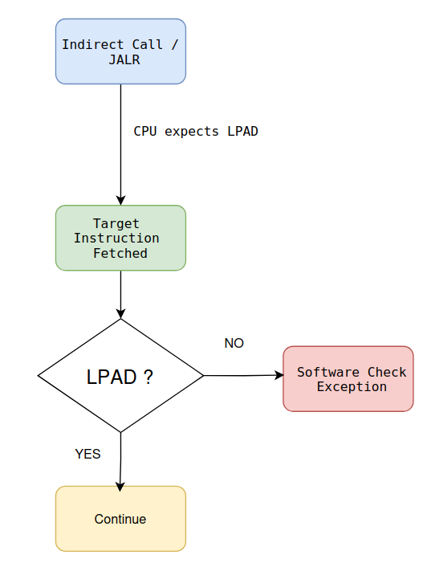
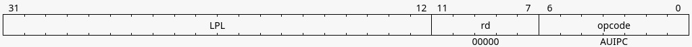
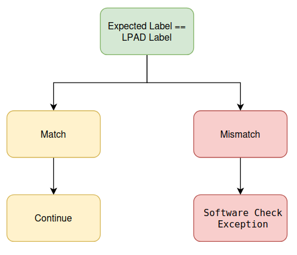

# Understanding the RISC-V Control-Flow Integrity (CFI) ISA - Part 1: Landing Pads (Zicfilp) 
## Introduction

I started studying the recently **RISC-V Control-Flow Integrity (CFI)** ISA extensions. I wanted to first understand **why these extensions exist** and **<mark class="bg-yellow-200 dark:bg-yellow-500/30">what security problems they solve</mark>**<mark class="bg-yellow-200 dark:bg-yellow-500/30">.</mark>

This post summarizes my understanding of **<mark class="bg-yellow-200 dark:bg-yellow-500/30">Section 33.1.1 (Landing Pad - Zicfilp)</mark>** from the official RISC-V Unprivileged ISA Specification.

**Reference**

*   Official Specification (Unprivileged ISA): [https://docs.riscv.org/reference/isa/v20260120/unpriv/unpriv-cfi.html](https://docs.riscv.org/reference/isa/v20260120/unpriv/unpriv-cfi.html)
    
*   Section Covered: **33.1.1 — Landing Pad (Zicfilp)**
    

* * *

### Why is Control-Flow Integrity Needed?

One of the most common attacks against modern software is **<mark class="bg-yellow-200 dark:bg-yellow-500/30">Control-Flow Hijacking</mark>**<mark class="bg-yellow-200 dark:bg-yellow-500/30">. </mark> Instead of injecting new code, an attacker simply changes **where the processor executes next**.

For example,

```plaintext
main()
↓
foo()
↓
return
↓
main()
```

This is the intended execution path.

Now imagine an attacker modifies the return address or a function pointer.

Execution becomes

```plaintext
main()
↓
foo()
↓
return
↓
system()
```

The processor is still executing valid instructions.

However, it is executing them in an **unauthorized order**.

This is exactly what **Control-Flow Integrity (CFI)** tries to prevent.

* * *

# Forward Edge vs Backward Edge

The specification divides control flow into two categories.

## Forward Edge

Execution moves **towards** another function. There is where we use <mark class="bg-yellow-200 dark:bg-yellow-500/30">LPAD </mark> (Landing Pad)

Examples:

*   Indirect Function Calls
    
*   Indirect Jumps
    

```plaintext
main()
↓
function pointer
↓ 
target function
```

* * *

## Backward Edge

Execution returns **back** to the caller.

```plaintext
main()
↓
foo()
↓
return
↓
main()
```

The Landing Pad extension only protects the **Forward Edge**.

Backward-edge protection is handled by the **Shadow Stack (Zicfiss)** extension, which will be covered in the next blog.

* * *

# What is an Indirect Call?

Consider the following example.

```c
void foo() {}

void bar() {}

int main()
{
    void (*fp)();

    fp = foo;

    fp();
}
```

Unlike a direct function call, the processor does not know the destination until runtime.

```plaintext
fp()
↓
Address stored inside fp
↓
Jump
```

If an attacker modifies the value of `fp`, execution can be redirected anywhere.

* * *

# Introducing Landing Pads

The idea behind Landing Pads is surprisingly simple.

Instead of allowing an indirect jump to enter **any instruction**, the processor only allows execution to begin at **approved locations**.

These approved locations start with a special instruction called **LPAD**.

Instead of

```plaintext
foo()
  ADD
  SUB
  RET
```

the function now begins with

```plaintext
foo()
  LPAD
  ADD
  SUB
  RET
```

The LPAD instruction acts like a **security checkpoint**.

Only destinations beginning with LPAD are considered valid indirect branch targets.

* * *

# Landing Pad Enforcement

(Its <mark class="bg-yellow-200 dark:bg-yellow-500/30">33.1.1.1</mark>) Whenever an indirect jump occurs, the processor expects the destination to begin with an <mark class="bg-yellow-200 dark:bg-yellow-500/30">LPAD</mark> instruction.

The overall process can be visualized as (I drew it on draw.io)

<p align="center">
  
</p>

If the first instruction is not LPAD, execution is immediately rejected.

* * *

# Expected Landing Pad (ELP)

The specification introduces an internal processor state called the **Expected Landing Pad (ELP)**.

Conceptually,

```plaintext
ELP = NO_EXPECTATION
```

means the processor is executing normally.

After an indirect call,

```plaintext
ELP = LP_EXPECTED
```

The processor now expects the next instruction to be LPAD.

If LPAD is found,

```plaintext
ELP
↓
Cleared
↓
Program Continues
```

Otherwise,

```plaintext
ELP
↓
Violation
↓
Software Check Exception
```

This mechanism allows the processor to verify that indirect control-flow transfers only reach authorized locations.

* * *

# LPAD Instruction Format

(Its <mark class="bg-yellow-200 dark:bg-yellow-500/30">33.1.1.2 </mark> )The LPAD instruction occupies one standard **32-bit RISC-V instruction**.

One of the important fields inside the instruction is the **<mark class="bg-yellow-200 dark:bg-yellow-500/30">20-bit</mark> Landing Pad Label (LPL)**. \[<mark class="bg-yellow-200 dark:bg-yellow-500/30">31:12</mark>\]

The specification provides the complete instruction encoding.

<p align="center">
  
</p>


* * *

# Why are Labels Needed?

Simply checking for LPAD is not always sufficient.

### Example:

Imagine three different functions.

```plaintext
Function A:
LPAD
(Label = 100)
```

```plaintext
Function B:
LPAD
(Label = 200)
```

```plaintext
Function C
LPAD
(Label = 300)
```

Suppose an indirect call is expected to reach **Function A**.

If execution accidentally lands at **Function C**, the destination still begins with LPAD.

Without labels, this jump would incorrectly be accepted.

The landing pad label solves this problem.

The processor verifies (made below diagram in draw.io)

<p align="center">
  
</p>

Only the correct landing pad is accepted.

* * *

# Real-Life Analogy

An <mark class="bg-yellow-200 dark:bg-yellow-500/30">airport</mark> provides a good analogy.

Entering the airport building is similar to passing the LPAD check.

However, that alone is not enough.

Your boarding pass must also match the correct flight.

```plaintext
Airport Entrance
↓
Security Check
↓
Boarding Gate
↓
Ticket Verification
↓
Correct Flight
```

Similarly,

*   LPAD verifies that execution reaches an authorized entry point.
    
*   The landing pad label verifies that it reaches the **correct** authorized entry point.
    

Both checks are necessary for secure control-flow.

* * *

# Key Takeaways

After studying Section **33.1.1**, these are my main observations:

*   <mark class="bg-yellow-200 dark:bg-yellow-500/30">Landing Pads protect </mark> **<mark class="bg-yellow-200 dark:bg-yellow-500/30">Forward-Edge Control Flow</mark>**.
    
*   Only indirect calls and indirect jumps are verified.
    
*   Valid destinations must begin with the **LPAD** instruction.
    
*   The processor maintains an **<mark class="bg-yellow-200 dark:bg-yellow-500/30">Expected Landing Pad (ELP)</mark>** state after indirect branches.
    
*   LPAD instructions include a **<mark class="bg-yellow-200 dark:bg-yellow-500/30">20-bit Landing Pad Label (LPL)</mark>** for stronger verification.
    
*   Incorrect landing pads result in a **Software Check Exception**.
    
*   Labels provide finer-grained control by ensuring execution reaches the intended destination rather than just any valid landing pad.