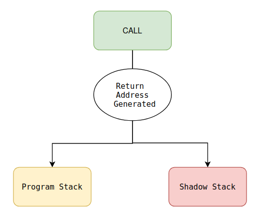
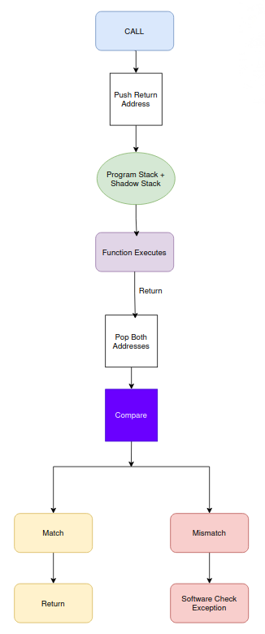

# Understanding the RISC-V Control-Flow Integrity (CFI) ISA - Part 2: Shadow Stack (Zicfiss)

<p align="center">
  
</p>

## Introduction

In the previous blog, I explored **Landing Pads (Zicfilp)**, which protect **forward-edge control flow** by ensuring that indirect branches only reach authorized destinations.

The second part of the RISC-V Control-Flow Integrity extensions focuses on an entirely different problem:

> **Protecting function return addresses.**

This is accomplished through the **Shadow Stack (Zicfiss)** extension.

This blog summarizes my understanding of **Section 33.1.2** of the official RISC-V Unprivileged ISA Specification.

**Reference**

*   Official Specification (Unprivileged ISA): [https://docs.riscv.org/reference/isa/v20260120/unpriv/unpriv-cfi.html](https://docs.riscv.org/reference/isa/v20260120/unpriv/unpriv-cfi.html)
    
*   Section Covered: **33.1.2 — Shadow Stack (Zicfiss)**
    

* * *

# Why Do We Need a Shadow Stack?

Before understanding the Shadow Stack, consider how a normal function call works.

```text
main()
↓
foo()
↓
return
↓
main()
```

When the processor executes a function call, it saves the **return address**. Later, when the function finishes, execution returns to exactly that saved address. Simple enough.Unfortunately, this return address is normally stored in regular memory. If an attacker manages to overwrite it, execution changes completely.

Instead of

```text
main()
↓
foo()
↓
main()
```

then execution becomes

```text
main()
↓
foo()
↓
secret_function()
```

The processor has no way of knowing the return address has been modified.

This type of attack is commonly known as a **Return Address Attack**, and it is one of the most common techniques used in Return-Oriented Programming (ROP).

* * *

# Forward Edge vs Backward Edge

Recall the two categories of control flow.

### Forward Edge

```text
CALL
↓
Target Function
```

Protected by <mark class="bg-yellow-200 dark:bg-yellow-500/30">Landing Pads (Zicfilp)</mark>

### Backward Edge

```text
RETURN
↓
Caller
```

Protected by <mark class="bg-yellow-200 dark:bg-yellow-500/30">Shadow Stack (Zicfiss)</mark>

Together, these two extensions secure both directions of program execution.

* * *

# What is a Shadow Stack?

*(Section 33.1.2)*

The simplest way to think about a Shadow Stack is:

> **It is a second stack used exclusively for storing trusted return addresses.**

Instead of relying only on the normal software stack, every function call also stores the return address inside this protected stack.

```text
Normal Stack
↓
Return Address
↓
Can be modified
```

* * *

```text
Shadow Stack
↓
Return Address
↓
Hardware Protected
```

Only the processor itself is allowed to modify the Shadow Stack.

Normal software cannot accidentally or maliciously overwrite its contents.

* * *

# Real-Life Analogy

Imagine leaving your house key inside your backpack. Anyone who steals the backpack now has the key. Now imagine storing a duplicate key inside a secure locker at the bank. Even if the backpack is stolen, the bank's copy remains safe.The normal program stack is like the backpack.

The Shadow Stack is the secure locker.

* * *

# Shadow Stack Pointer (SSP)

*(Section 33.1.2.1)*

Just as the normal stack has a **Stack Pointer (SP)**, the Shadow Stack maintains its own pointer.

The specification calls this the **Shadow Stack Pointer (SSP).**

```text
Normal Stack
↓
SP
```

```text
Shadow Stack
↓
SSP
```

The processor uses the SSP to locate the next trusted return address.

Software cannot freely manipulate this pointer during normal execution.

* * *

# Push to the Shadow Stack

*(Section 33.1.2.4)*

Whenever a function call occurs, the processor performs two operations.

```text
CALL
↓
Push Return Address
↓
Normal Stack
```

At the same time,

```text
CALL
↓
Push Return Address
↓
Shadow Stack
```

<mark class="bg-yellow-200 dark:bg-yellow-500/30">Both copies contain the exact same return address.</mark>

However, <mark class="bg-yellow-200 dark:bg-yellow-500/30">one copy is trusted</mark>.

* * *

Overall behavior can be visualized as

<p align="center">
  
</p>


Both stacks now contain identical return addresses.

* * *

# Pop from the Shadow Stack

*(Section 33.1.2.5)*

When the function finishes, the processor pops both copies.

```text
Program Stack
↓
Return Address
```

* * *

```text
Shadow Stack
↓
Trusted Return Address
```

The processor compares them.

If they match, execution continues normally.

If they differ, the processor raises a software check exception because the return address has been corrupted.

* * *

# Why Is This Secure?

Suppose an attacker changes the <mark class="bg-yellow-200 dark:bg-yellow-500/30">normal stack</mark> to let say <mark class="bg-yellow-200 dark:bg-yellow-500/30">0x5000</mark> while the <mark class="bg-yellow-200 dark:bg-yellow-500/30">Shadow Stack</mark> is <mark class="bg-yellow-200 dark:bg-yellow-500/30">0x1000</mark> so during comparison <mark class="bg-yellow-200 dark:bg-yellow-500/30">0x5000≠0x1000</mark> so immediately <mark class="bg-yellow-200 dark:bg-yellow-500/30">Software Check Exception</mark> occurs !

Execution never reaches the malicious address.

* * *

# Shadow Stack Instructions

The Zicfiss extension introduces new instructions for manipulating the Shadow Stack.

The specification defines dedicated instructions that allow trusted push, pop, and verification operations while preventing ordinary software from arbitrarily modifying the protected stack.

Rather than exposing the Shadow Stack as normal memory, these instructions ensure that all accesses follow well-defined hardware rules.

# Overall Flow

<p align="center">
  
</p>


This comparison forms the core security mechanism of the Shadow Stack. (drew it on draw.io)

* * *

# Real-Life Example

Imagine taking an important exam. Your answers are written on your answer sheet. At the same time, an invigilator secretly keeps a verified copy.

```text
Student Sheet
↓
May be altered
```

```text
Official Copy
↓
Protected
```

At the end of the exam, both copies are compared. If they differ,someone clearly tampered with the original.

This is essentially how the Shadow Stack protects return addresses.

* * *

# Key Takeaways

After studying **Section 33.1.2**, these are my main observations:

*   Shadow Stack protects **<mark class="bg-yellow-200 dark:bg-yellow-500/30">Backward-Edge Control Flow</mark>**.
    
*   It maintains a separate hardware-protected copy of every return address.
    
*   The **<mark class="bg-yellow-200 dark:bg-yellow-500/30">Shadow Stack Pointer (SSP)</mark>** tracks the protected stack independently of the normal stack.
    
*   Every function call pushes the return address onto both stacks.
    
*   Every function return <mark class="bg-yellow-200 dark:bg-yellow-500/30">compares</mark> both copies before allowing execution to continue.
    
*   Any <mark class="bg-yellow-200 dark:bg-yellow-500/30">mismatch</mark> indicates a possible attack and results in a <mark class="bg-yellow-200 dark:bg-yellow-500/30">software check exception.</mark>
    
*   Together with Landing Pads (<mark class="bg-yellow-200 dark:bg-yellow-500/30">Zicfilp</mark>), the Shadow Stack provides comprehensive hardware-assisted Control-Flow Integrity.