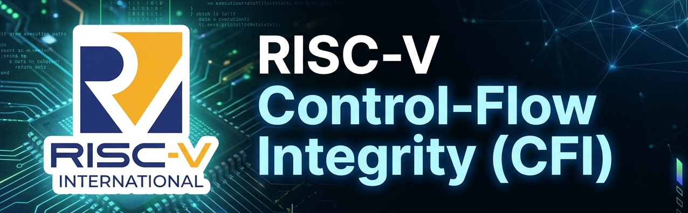
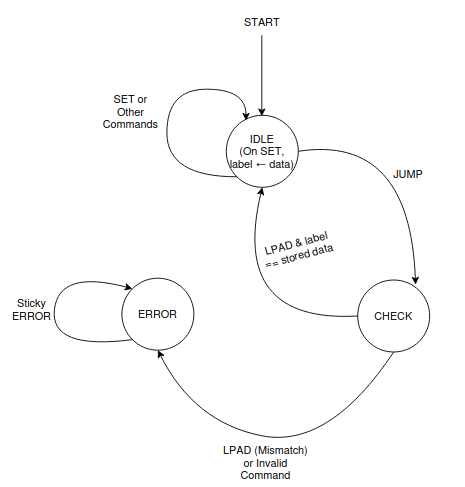
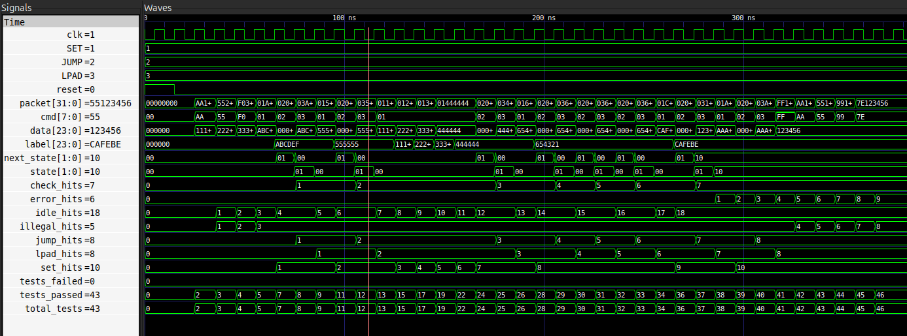

# RISC-V Control-Flow Integrity (CFI) 

<p align="center">

[](https://en.wikipedia.org/wiki/SystemVerilog)
[](https://lfx.linuxfoundation.org/tools/mentorship/)
[](https://riscv.org/)
[](https://github.com/riscv/riscv-cfi)
[](https://en.wikipedia.org/wiki/Register-transfer_level)
[](https://en.wikipedia.org/wiki/Finite-state_machine)
[](https://github.com/bsc-loca/sargantana)
[](https://github.com/bsc-loca/sargantana)


</p>


<p align="center">
  
</p>


---

## Overview

This repository contains my solution for the **Linux Foundation (LFX) Mentorship Fall 2026 Coding Challenge** for the project:

> **Implementation of the RISC-V ISA Extensions for Control-Flow Integrity**

The objective was to design a **3-state finite state machine (FSM)** in **SystemVerilog** that models a simplified hardware mechanism for **Control-Flow Integrity (CFI)**.

The implementation demonstrates how a processor can verify indirect control-flow transfers by storing a trusted label and validating landing pads before execution continues.

---

## Background

Modern software attacks frequently exploit memory corruption vulnerabilities to hijack program execution.

Control-Flow Integrity (CFI) prevents these attacks by ensuring that execution only follows valid control-flow paths.

This challenge captures the fundamental behavior of CFI using three states:

| State | Encoding | Description |
|-------|:--------:|-------------|
| **IDLE** | `00` | Waits for incoming commands. Stores the secure label when a `SET` command is received and transitions to **CHECK** upon receiving `JUMP`. |
| **CHECK** | `01` | Waits for a valid `LPAD` packet and compares its label against the stored secure label. |
| **ERROR** | `10` | Permanent sticky error state entered whenever landing pad verification fails or an invalid command is received during verification. |

Although simplified, the FSM reflects the core concept used by hardware-assisted CFI mechanisms in modern RISC-V processors.

---

# Packet Format

Each clock cycle the FSM receives one 32-bit packet.

| Bits | Description |
|------|-------------|
| **[31:24]** | Command |
| **[23:0]** | Data / Label |

Supported commands:

| Command | Value |
|----------|------:|
| SET | 0x01 |
| JUMP | 0x02 |
| LPAD | 0x03 |

---

# FSM

<p align="center">



</p>

---

# State Transition Table

| Current State | Command | Condition | Next State | Action |
|---------------|----------|-----------|------------|--------|
| IDLE | SET | Always | IDLE | Store label |
| IDLE | JUMP | Always | CHECK | Wait for LPAD |
| IDLE | Other | Default | IDLE | Ignore |
| CHECK | LPAD | Label Match | IDLE | Valid control flow |
| CHECK | LPAD | Label Mismatch | ERROR | Security violation |
| CHECK | Other | Default | ERROR | Invalid transition |
| ERROR | Any | Always | ERROR | Sticky state |


---

# Design Decisions and Assumptions

Below are the Implementation details (Please Open both markdown files) :

| Document | Description |
|----------|-------------|
| [`Design_Decisions.md`](Design_Decisions.md) | Architectural decisions and RTL implementation rationale. |
| [`Assumptions.md`](Assumptions.md) | Assumptions made where the coding challenge specification leaves implementation details undefined. |


---

# RTL Implementation


The RTL implementation consists of a single SystemVerilog module : [`cfi_fsm.sv`](src/rtl/cfi_fsm.sv) 

Main internal components:

- 3-state FSM
- 24-bit label register
- Command decoder
- Next-state combinational logic
- Sequential state register

The FSM follows a Moore-style implementation where the state register is updated on the rising edge of the clock.

---

# Verification

Multiple self-checking testbenches were developed during implementation.

| Testbench | Description |
|------------|-------------|
| [`cfi_fsm_tb.sv`](src/tb/cfi_fsm_tb.sv) | Initial functional verification(5 Tests) |
| [`cfi_fsm_v2_tb.sv`](src/tb/cfi_fsm_v2_tb.sv) | Improved verification transcript(8 Tests) |
| [`cfi_fsm_v3_tb.sv`](src/tb/cfi_fsm_v3_tb.sv) | Extended functional verification(16 Tests) |
| [`cfi_fsm_v4_tb.sv`](src/tb/cfi_fsm_v4_tb.sv) | Final self-checking regression testbench (46 Tests/verification checks) |


The verification environment checks:

- Reset behavior
- Label programming
- Multiple label updates
- Valid control-flow sequences
- Invalid landing-pad detection
- Sticky ERROR state
- Illegal command handling
- Stress testing
- State transitions

## Verification Strategy

Kindly Open below markdown file to see my Verification methodology, regression strategy, and functional coverage :

[`Verification_Strategy.md`](Verification_Strategy.md) 

---

# Waveform

## Successful Control Flow
Its for 46 tests (`cfi_fsm_v4_tb`)

<p align="center">



</p>

You can also see the rest below :

| Testbench | Simulations | 
|------------|------------|
| [`cfi_fsm_tb`](src/tb/cfi_fsm_tb.sv) | [`cfi_fsm.png`](Simulations/cfi_fsm.png) | 
| [`cfi_fsm_v2_tb`](src/tb/cfi_fsm_v2_tb.sv) | [`cfi_fsm_v2.png`](Simulations/cfi_fsm_v2.png) | 
| [`cfi_fsm_v3_tb`](src/tb/cfi_fsm_v3_tb.sv) | [`cfi_fsm_v3.png`](Simulations/cfi_fsm_v3.png) | 
| [`cfi_fsm_v4_tb`](src/tb/cfi_fsm_v4_tb.sv) | [`cfi_fsm_v4.png`](Simulations/cfi_fsm_v4.png) | 


---
## Verification Summary

There were total 46 Tests that verifies mainly these 10 most important scenarios:

| Test ID | Verification Scenario | Checks | Result |
|:------:|------------------------|:------:|:------:|
| 01 | Reset Functionality | FSM enters **IDLE** and clears the label register after reset. |  PASS |
| 02 | Illegal Commands in IDLE | Verifies unknown commands are ignored while remaining in **IDLE**. |  PASS |
| 03 | Valid Transaction #1 | Verifies **SET → JUMP → LPAD** sequence with a matching label. |  PASS |
| 04 | Valid Transaction #2 | Repeats a complete valid transaction using a different secure label. |  PASS |
| 05 | Multiple Label Updates | Verifies consecutive **SET** operations correctly overwrite the stored label. |  PASS |
| 06 | Valid Transaction After Label Updates | Confirms the latest stored label is used during landing pad verification. |  PASS |
| 07 | Continuous Packet Stream | Verifies multiple consecutive valid transactions without reset. |  PASS |
| 08 | Unauthorized Landing Pad | Detects a mismatched landing pad and transitions to **ERROR**. |  PASS |
| 09 | Sticky ERROR Verification | Verifies **SET**, **JUMP**, and **LPAD** are ignored once **ERROR** is entered. |  PASS |
| 10 | Illegal Commands in ERROR | Confirms illegal commands cannot exit the sticky **ERROR** state. |  PASS |

## Transcript(Just the Summary part)

<p align="center">


</p>

---

## Simulation Transcripts

Above one is just the Summary part for [`cfi_fsm_v4_tb`](src/tb/cfi_fsm_v4_tb.sv). While the Simulation transcripts for each testbench are available under the `Results/Transcripts/` directory as txt files. Also their screenshots are under `Results/Screenshots`.

| Testbench | Transcript | 
|------------|------------|
| [`cfi_fsm_tb`](src/tb/cfi_fsm_tb.sv) | [`transcript.txt`](Results/Transcripts/transcript.txt) | 
| [`cfi_fsm_v2_tb`](src/tb/cfi_fsm_v2_tb.sv) | [`transcript_v2.txt`](Results/Transcripts/transcript_v2.txt) | 
| [`cfi_fsm_v3_tb`](src/tb/cfi_fsm_v3_tb.sv) | [`transcript_v3.txt`](Results/Transcripts/transcript_v3.txt) | 
| [`cfi_fsm_v4_tb`](src/tb/cfi_fsm_v4_tb.sv) | [`transcript_v4.txt`](Results/Transcripts/transcript_v4.txt) | 

---

# Build Instructions

Compile and simulate using:

```bash
make TB=cfi_fsm_v4_tb
```

It will also open the waveform and Transcript

Clean generated files:

```bash
make clean
```

---

# Results

✔ All verification scenarios pass successfully.

Verification includes:

- Functional verification
- Security verification
- State transition verification
- Self-checking assertions
- Coverage-style reporting

---

# Future Work 

POSSIBLE extensions may include:

- Shadow Stack support
- Landing Pad instruction decoding
- Pipeline integration
- RVFI compatibility
- Sargantana core integration
- RISC-V CFI ISA extension implementation

---

# References / Learning Material

## CFI Specification
- [RISC-V Control-Flow Integrity (CFI) Specification (Unpriv)](https://docs.riscv.org/reference/isa/unpriv/unpriv-cfi.html)
- [RISC-V CFI Spec - (Priv)](https://docs.riscv.org/reference/isa/v20260120/priv/priv-cfi.html)

## Sargantana Repository
- [Sargantana RISC-V Processor](https://github.com/bsc-loca/sargantana)

## PDFs of Spec
- [riscv-privileged.pdf](References/riscv-privileged.pdf)
- [riscv-spec.pdf](References/riscv-spec.pdf)

## CVA6 Research Paper
- [CVA6-CFI.pdf](References/CVA6-CFI.pdf)

---
# Contributor 

**Muhammad Waleed Akram**

University of Engineering and Technology (UET) Lahore

Linux Foundation LFX Mentorship — Fall 2026 Coding Challenge
