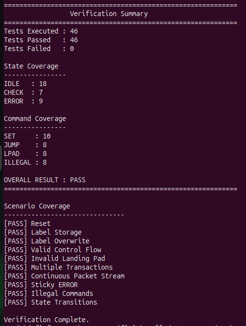

# RISC-V Control-Flow Integrity (CFI) FSM

<p align="center">

[](https://en.wikipedia.org/wiki/SystemVerilog)
[](https://lfx.linuxfoundation.org/tools/mentorship/)
[](https://riscv.org/)
[](https://github.com/riscv/riscv-cfi)
[](https://en.wikipedia.org/wiki/Register-transfer_level)
[](https://en.wikipedia.org/wiki/Finite-state_machine)
[](https://github.com/bsc-loca/sargantana)
[](https://github.com/bsc-loca/sargantana)


</p>

---

## Overview

This repository contains my solution for the **Linux Foundation (LFX) Mentorship Fall 2026 Coding Challenge** for the project:

> **Implementation of the RISC-V ISA Extensions for Control-Flow Integrity**

The objective was to design a **3-state finite state machine (FSM)** in **SystemVerilog** that models a simplified hardware mechanism for **Control-Flow Integrity (CFI)**.

The implementation demonstrates how a processor can verify indirect control-flow transfers by storing a trusted label and validating landing pads before execution continues.

---

## Background

Modern software attacks frequently exploit memory corruption vulnerabilities to hijack program execution.

Control-Flow Integrity (CFI) prevents these attacks by ensuring that execution only follows valid control-flow paths.

This challenge captures the fundamental behavior of CFI using three states:

- **IDLE** – Accepts commands and stores trusted labels.
- **CHECK** – Waits for landing-pad verification.
- **ERROR** – Permanent fault state entered whenever verification fails.

Although simplified, the FSM reflects the core concept used by hardware-assisted CFI mechanisms in modern RISC-V processors.

---

# Packet Format

Each clock cycle the FSM receives one 32-bit packet.

| Bits | Description |
|------|-------------|
| **[31:24]** | Command |
| **[23:0]** | Data / Label |

Supported commands:

| Command | Value |
|----------|------:|
| SET | 0x01 |
| JUMP | 0x02 |
| LPAD | 0x03 |

---

# FSM

<p align="center">


</p>

---

# State Transition Table

| Current State | Command | Condition | Next State | Action |
|---------------|----------|-----------|------------|--------|
| IDLE | SET | Always | IDLE | Store label |
| IDLE | JUMP | Always | CHECK | Wait for LPAD |
| IDLE | Other | Default | IDLE | Ignore |
| CHECK | LPAD | Label Match | IDLE | Valid control flow |
| CHECK | LPAD | Label Mismatch | ERROR | Security violation |
| CHECK | Other | Default | ERROR | Invalid transition |
| ERROR | Any | Always | ERROR | Sticky state |


---

# RTL Implementation

The RTL implementation consists of a single SystemVerilog module.

Main internal components:

- 3-state FSM
- 24-bit label register
- Command decoder
- Next-state combinational logic
- Sequential state register

The FSM follows a Moore-style implementation where the state register is updated on the rising edge of the clock.

---

# Verification

Multiple self-checking testbenches were developed during implementation.

| Testbench | Description |
|------------|-------------|
| `cfi_fsm_tb.sv` | Initial functional verification |
| `cfi_fsm_v2_tb.sv` | Improved transcript formatting |
| `cfi_fsm_v3_tb.sv` | 16 self-checking verification tests |
| `cfi_fsm_v4_tb.sv` | Extended regression (46 passing checks) |

The verification environment checks:

- Reset behavior
- Label programming
- Multiple label updates
- Valid control-flow sequences
- Invalid landing-pad detection
- Sticky ERROR state
- Illegal command handling
- Stress testing
- State transitions

---

# Waveforms

## Successful Control Flow
Its for 46 tests (`cfi_fsm_v4_tb`)

<p align="center">


</p>

---

## ModelSim Verification

<p align="center">



</p>

---

# Build Instructions

Compile and simulate using:

```bash
make TB=cfi_fsm_v4_tb
```

It will also open the waveform and Transcript

Clean generated files:

```bash
make clean
```

---

# Results

✔ All verification scenarios pass successfully.

Verification includes:

- Functional verification
- Security verification
- State transition verification
- Self-checking assertions
- Coverage-style reporting

---

# Future Work

Possible extensions include:

- Shadow Stack support
- Landing Pad instruction decoding
- Pipeline integration
- RVFI compatibility
- Sargantana core integration
- RISC-V CFI ISA extension implementation

---

# References

- RISC-V Control-Flow Integrity ISA Extension
- Linux Foundation LFX Mentorship
- Sargantana RISC-V Processor

---

# Author

**Muhammad Waleed Akram**

University of Engineering and Technology (UET) Lahore

Linux Foundation LFX Mentorship — Fall 2026 Coding Challenge
